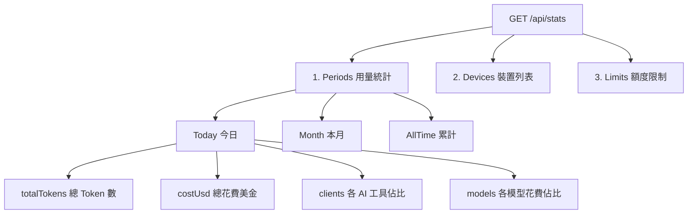

# 遷移 Cloudflare Worker 與行動端瀏覽指南

要將你的 Token 監控系統遷移到雲端，並在手機上優雅瀏覽，你需要完成以下步驟。這裡提供 **「完全免開發 App」的最簡單瀏覽方式** 以及 **API 數據白話解析**。

---

## 🛠️ 第一步：把 Win11 Hub 遷移到 Cloudflare Worker

這個步驟可以讓你的 Linux Agents 與 Win11 不再依賴本地區網連線，直接將用量安全地同步到雲端。

1. **準備環境**：確認你的 Win11 電腦上裝有 Node.js (>=22)。
2. **部署 Worker**：
   在電腦的終端機執行以下指令：
   ```bash
   cd worker
   npm install
   npx wrangler login                          # 會自動打開瀏覽器，請登入你的 Cloudflare 帳號
   npx wrangler secret put TOKEN_MONITOR_SECRET # 輸入你自訂的通訊密鑰（例如一串隨機英文數字）
   npx wrangler deploy                         # 部署至雲端
   ```
   *部署成功後，終端機會印出 Worker 網址，例如：`https://token-monitor-hub.yourname.workers.dev`*

3. **修改 Agent 與 Win11 的上報網址**：
   * **Linux Agents**：修改 `.env` 檔案（或啟動指令），將 `TOKEN_MONITOR_HUB_URL` 設為你的 Worker 網址，`TOKEN_MONITOR_SECRET` 設為剛剛的密鑰。
   * **Win11 Widget**：在軟體 UI 的 **Multi-device Sync (多裝置同步)** 中，將 Hub URL 設為 Worker 網址，填入 Secret，並將模式設為上報（Client 模式）。

---

## 📱 第二步：最簡單的手機瀏覽方式（預期會長什麼樣）

你不需要寫 PWA App，有以下兩種最簡單的做法：

### 方式 A：手機桌面小卡片 (Widgets) —— 適合「一眼監控」
利用現成的小工具 App，直接在手機桌面上放一個卡片，不需開啟網頁即可看見最新用量。

* **iOS (使用 Widgy App)**：
  在 App 中新增一個 JS 腳本元素，貼入 [worker/README.zh-TW.md](../worker/README.zh-TW.md#widgy) 的代碼，設定好 URL 與 Secret。
* **Android (使用 KWGT App)**：
  建立一個桌面小工具，使用 `flow` 或 `http` 請求發送至你的 Worker API，提取今日用量與金額。
* **預期效果**：
  > [!NOTE]
  > **手機桌面效果預覽：**
  > ┌──────────────────────────┐
  > │ 🤖 Token Monitor         │
  > │ **15.4K** tokens          │
  > │ **$0.23** USD today       │
  > │ [■■■■■□□□□□] Claude 60%  │
  > └──────────────────────────┘

---

### 方式 B：極薦！讓 Worker 直接當網頁顯示 —— 適合「詳細瀏覽」
只要在 `worker/src/index.js` 的 `fetch` 處理中插入一個 HTML 回傳邏輯，當你用手機瀏覽器打開 `https://your-worker.workers.dev?secret=你的密鑰` 時，就能直接顯示一個超精美的暗黑毛玻璃風格網頁！

你只需在 `worker/src/index.js` 的 `fetch(request)` 開頭（大約 123 行處）加上這段程式碼：

```javascript
    // 網頁瀏覽器直接開啟根目錄時，回傳精美儀表板
    if (url.pathname === '/' || url.pathname === '/index.html') {
      if (!isAuthorized(request, this.secret)) {
        return new Response('Unauthorized - Please provide ?secret=your_secret in URL', { status: 401 });
      }
      
      const stats = await this.getStats();
      const today = stats.periods.today || { totalTokens: 0, costUsd: 0 };
      const month = stats.periods.month || { totalTokens: 0, costUsd: 0 };
      
      const html = `
      <!DOCTYPE html>
      <html>
      <head>
        <meta charset="utf-8"><meta name="viewport" content="width=device-width, initial-scale=1">
        <title>Token Monitor Mobile</title>
        <style>
          body { background: #0b0f19; color: #f3f4f6; font-family: -apple-system, system-ui, sans-serif; padding: 20px; }
          .card { background: rgba(255,255,255,0.03); border: 1px solid rgba(255,255,255,0.08); border-radius: 16px; padding: 20px; margin-bottom: 16px; backdrop-filter: blur(10px); }
          h1 { font-size: 1.5rem; margin-bottom: 20px; display: flex; align-items: center; justify-content: space-between; }
          .val { font-size: 2rem; font-weight: bold; color: #60a5fa; margin: 8px 0; }
          .label { color: #9ca3af; font-size: 0.85rem; text-transform: uppercase; }
          .grid { display: grid; grid-template-columns: 1fr 1fr; gap: 12px; }
          .dot { width: 8px; height: 8px; background: #10b981; border-radius: 50%; display: inline-block; margin-right: 6px; box-shadow: 0 0 8px #10b981;}
          .device-row { display: flex; justify-content: space-between; padding: 8px 0; border-bottom: 1px solid rgba(255,255,255,0.05); }
        </style>
      </head>
      <body>
        <h1><span><span class="dot"></span>Token Monitor</span> <span style="font-size: 0.9rem; color: #9ca3af;">Cloud Hub</span></h1>
        
        <div class="card">
          <div class="label">Today's Usage</div>
          <div class="val">\${Number(today.totalTokens).toLocaleString()} <span style="font-size: 1rem; font-weight:normal; color:#9ca3af;">tokens</span></div>
          <div style="color: #34d399; font-weight: 500;">\$\${today.costUsd.toFixed(4)} USD</div>
        </div>

        <div class="card">
          <div class="label">This Month</div>
          <div class="val">\${Number(month.totalTokens).toLocaleString()}</div>
          <div style="color: #34d399; font-weight: 500;">\$\${month.costUsd.toFixed(2)} USD</div>
        </div>

        <div class="card">
          <div class="label" style="margin-bottom: 8px;">Active Devices (\${stats.devices.length})</div>
          \${stats.devices.map(d => \`
            <div class="device-row">
              <span>\${d.hostname} (\${d.platform})</span>
              <span style="color: \${d.stale ? '#ef4444' : '#34d399'}">\${d.stale ? 'Offline' : 'Online'}</span>
            </div>
          \`).join('')}
        </div>
      </body>
      </html>`;
      return new Response(html, { headers: { 'content-type': 'text/html; charset=utf-8' } });
    }
```
* **預期效果**：
  打開手機瀏覽器輸入網址，即可看到一個精心設計、與系統深色模式完美契合的用量面板。你可以直接在手機瀏覽器中選擇「**加入主畫面**」，它就會像一個獨立的 App 一樣，點開即看！

---

## 📊 第三步：API 數據結構白話圖解（API 裡到底有啥資訊？）

當你呼叫 `GET /api/stats` 時，Worker 回傳的 JSON 包含以下核心區塊，結構清晰易懂：



### 數據欄位白話對照表

| JSON 欄位路徑 | 白話含意 | 實用場景範例 |
| :--- | :--- | :--- |
| `periods.today.totalTokens` | 今日所有機器用掉的總 Token 數 | 用來了解今天打字讓 AI 讀了寫了多少字 |
| `periods.today.costUsd` | 今日產生的 API 估計花費（美金） | 掌握今天的荷包支出 |
| `periods.today.clients` | 今日各 AI 工具的 Token 數（如 `claude: 5000`） | 知道自己今天主要是用 Cline、Claude Code 還是 Zed |
| `periods.today.models` | 今日各 AI 模型的 Token 數（如 `gemini-1.5: 800`） | 知道今天哪隻模型最常被叫出來 |
| `devices` | 目前所有已連線機器的列表與最後上報時間 | 確認 Linux headless 是否有正常運作，還是斷線了 |
| `limits.providers` | AI 帳號額度（例如 Claude Code 限制） | 查看今天/本週的 Claude 額度還剩多少 %，是否快要被限流 |
